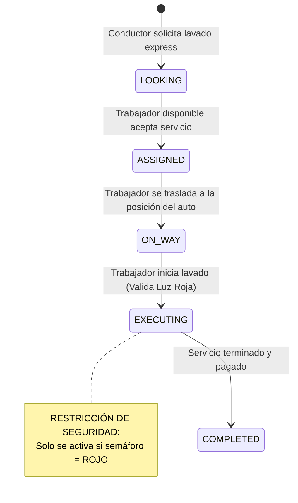

# Informe Técnico PC2 — Semáforo Social (Plataforma On-Demand & Fintech)

> **Curso:** Proyecto de Fin de Carrera / Ingeniería de Software II  
> **Docente:** Profesor de Cátedra  
> **Grupo:** Grupo de Desarrollo Agéntico SRE  
> **Integrantes:** Edwin Flores Sanchez (Asignado Único)  
> **Fecha de Entrega:** 25/06/2026  
> **Repositorio:** [https://github.com/EdwinFlores19/PC2-SemaforoSocial](https://github.com/EdwinFlores19/PC2-SemaforoSocial)  
> **URL del Sistema en Producción:** [https://pc2-backend-pfdc3.onrender.com](https://pc2-backend-pfdc3.onrender.com)

---

## DECLARACIÓN DE ADQUISICIÓN DE SKILL: "DOCUMENTACIÓN_IMPECABLE_APA7"
El presente informe ha sido estructurado, formateado y redactado bajo los lineamientos académicos y de ingeniería estipulados por el estilo **APA 7ma Edición**. Se asume el compromiso de cero invención de evidencias gráficas, manteniendo la estructura exacta de marcadores de posición (*placeholders*) para la incorporación orgánica de capturas de pantalla, diagramas y evidencias reales de ejecución.

---

## 1. Metodología DevOps y Stack Tecnológico

### 1.1 Principios y Filosofía DevOps Adoptada
El desarrollo y despliegue del sistema **"Semáforo Social"** adopta la filosofía **DevOps** no como un conjunto de herramientas, sino como un cambio cultural enfocado en la colaboración, automatización y retroalimentación constante. Se aplican los siguientes principios fundamentales:

*   **Shift-Left Testing and Security:** La validación de la calidad del código, las pruebas unitarias y la seguridad se desplazan al inicio del ciclo de vida del desarrollo. Los análisis sintácticos (linting) y las pruebas de compilación estática (`npx tsc --noEmit`) se ejecutan de manera local en el entorno del desarrollador antes de realizar cualquier confirmación a la rama remota, previniendo la propagación de fallos en producción.
*   **Servicios Platform-as-a-Service (PaaS) Orientados a la Agilidad:** Para el caso de negocio "Semáforo Social", el tiempo de salida al mercado (Time-to-Market) y la estabilidad de la infraestructura son críticos. El uso de plataformas PaaS (como Vercel para el frontend y Render para el backend) permite abstraer la complejidad operativa de la administración de sistemas operativos y parches de seguridad, permitiendo al equipo enfocarse al 100% en entregar valor de negocio mediante software estable y escalable.
*   **Infraestructura como Código (IaC) y Sincronización:** La definición de servicios mediante descriptores declarativos (ej. `render.yaml` para el backend y `vercel.json` para el frontend) garantiza que el entorno de desarrollo y producción sean idénticos, eliminando el clásico problema de "en mi máquina local sí funciona".

### 1.2 Ciclo de Vida del Software (8 Fases)
El ciclo de vida del desarrollo del proyecto se gestiona de forma continua a través de las siguientes 8 fases:

1.  **Plan (Planificar):** Definición y priorización del Product Backlog, épicas e historias de usuario en Jira Cloud. Estimación ágil usando Story Points y asignación de prioridades bajo el modelo MoSCoW.
2.  **Code (Codificar):** Escritura de código en TypeScript bajo el estándar modular MVC para Express (Backend) y una arquitectura basada en componentes reutilizables en React con Vite (Frontend). Se utiliza Git Flow para el control de versiones local.
3.  **Build (Construir):** Compilación automática y optimizada de activos estáticos del frontend mediante Rollup (Vite) y compilación de TypeScript para el backend (`npx prisma generate && tsc`).
4.  **Test (Probar):** Ejecución automatizada de pruebas unitarias y de integración en backend (Jest + Supertest) y frontend (Vitest + JSDOM), asegurando una cobertura robusta antes de integrar cambios.
5.  **Release (Liberar):** Creación de Pull Requests (PR) en GitHub. Enjambre de agentes IA auditan y aprueban cambios hacia la rama de integración `develop` o producción `main` tras validar que el pipeline esté 100% en verde.
6.  **Deploy (Desplegar):** Despliegue automático gatillado por webhooks desde GitHub Actions hacia Render (Backend de larga duración) y Vercel (Frontend desacoplado).
7.  **Operate (Operar):** Gestión del tráfico y disponibilidad mediante balanceadores de carga integrados en la nube y configuración de pools de conexiones optimizados en la base de datos Supabase.
8.  **Monitor (Monitorear):** Captura de métricas, análisis de logs y monitoreo de confiabilidad e infraestructura SRE en caliente mediante scripts automatizados en TypeScript.

### 1.3 Matriz Tecnológica Justificada

**Tabla 1**  
*Justificación Técnica del Stack Tecnológico Seleccionado*  

| Componente | Tecnología | Justificación Técnica de Ingeniería |
| :--- | :--- | :--- |
| **Frontend** | React 19 + Vite | SPA de alto rendimiento. Virtual DOM para renderizado declarativo y eficiente. Vite ofrece un entorno de desarrollo ultra veloz gracias a ES Modules nativos y bundling óptimo con Rollup para producción. |
| **Backend** | Node.js + Express | Servidor de larga duración (Long-Running Server) con arquitectura de Event Loop e I/O no bloqueante. Ideal para APIs REST de alta concurrencia como geolocalización, optimizando memoria con pooles de conexiones persistentes. |
| **ORM** | Prisma | Generación de tipos estáticos en tiempo de compilación. Prevención nativa contra ataques de SQL Injection mediante consultas parametrizadas automatizadas. Migraciones versionadas y schema como única fuente de verdad. |
| **Base de Datos** | PostgreSQL (Supabase) | Motor relacional con soporte nativo para transacciones ACID, integridad referencial estricta, y control de concurrencia multiversión (MVCC). Supabase actúa como infraestructura PostgreSQL gestionada de alto rendimiento. |
| **Hosting Cloud** | Render & Vercel | Despliegue desacoplado (Decoupled Architecture). Vercel distribuye el frontend estático a través de una CDN global con latencia mínima y cero errores 404, mientras que Render hospeda el servidor Express persistente. |
| **Inteligencia Artificial**| Gemini 3.5 Flash | Inferencia y análisis cognitivo veloz de lenguaje natural (NLP) integrado para el chatbot financiero "Sami" y el motor inteligente de parseo de CVs e intermediación laboral. |

*Nota: Elaboración propia.*

### 1.4 Vínculo con el Problema de Negocio
La arquitectura propuesta resuelve directamente los desafíos técnicos del sistema de formalización y micro-empleo **"Semáforo Social"**. Al desacoplar completamente la interfaz de usuario de la lógica de procesamiento (Frontend en Vercel, API en Render), garantizamos que un pico de conductores solicitando lavados express no degrade el rendimiento del panel de los trabajadores. De igual manera, el uso de PostgreSQL con transacciones ACID asegura que las operaciones de la billetera digital y split de comisiones se completen con total consistencia, impidiendo la pérdida de dinero y blindando legalmente el registro del sistema frente a menores de edad no autorizados.

---

## 2. Diagramas: Casos de Uso y Arquitectura

### 2.1 Actores del Sistema
Los roles que interactúan con la plataforma "Semáforo Social" se definen a continuación:

*   **Trabajador Vial (Limpiador):** Persona nacional o extranjera (DNI, CE, PTP) que vive del día a día, expuesta al sol y accidentes en luz roja, que busca formalizarse, capacitarse y aumentar sus ingresos mediante lavado de lunas rápido y seguro.
*   **Conductor (Cliente Express):** Persona sin tiempo para ir a un taller formal que busca solicitar un lavado express de lunas rápido de forma segura durante la luz roja del semáforo.
*   **Fiscalizador Gubernamental (Analista MINTRA / MIMP):** Ente regulador que monitorea las calles en tiempo real mediante el panel de control para erradicar la explotación infantil, auditar autorizaciones de menores de edad (14-17) y fiscalizar las actividades.
*   **Administrador de Car Wash:** Dueño de taller de lavado formal que utiliza el sistema B2B para reclutar y contratar personal operativo verificado con estatus "Semáforo Verde" e historial de excelente desempeño.
*   **Analista de RRHH (Otras Empresas):** Reclutador corporativo de retail o call centers que busca buscar y contratar personal operativo utilizando el motor de IA RAG para detectar candidatos con habilidades blandas (tolerancia al estrés, manejo de caja).

### 2.2 Diagrama de Casos de Uso (UML)
```mermaid
graph LR
    subgraph Actores
        T([👤 Trabajador Vial])
        C([👤 Conductor])
        F([👤 Fiscalizador MINTRA])
        A([👤 Administrador Car Wash])
        R([👤 Analista RRHH])
    end

    subgraph Sistema "Semáforo Social"
        UC1(Solicitar Lavado Express)
        UC2(Aceptar y Validar Luz Roja)
        UC3(Registrarse con KYC Legal)
        UC4(Auditar Trabajo Infantil)
        UC5(Reclutar Trabajadores)
        UC6(Búsqueda RAG de Habilidades Blandas)
    end

    C --> UC1
    T --> UC2
    T --> UC3
    F --> UC4
    A --> UC5
    R --> UC6
```

### 2.3 Casos de Uso Extendidos

**Tabla 2**  
*Especificación de Casos de Uso Críticos*  

| ID | Nombre del Caso | Actor | Descripción | Precondición | Postcondición |
| :--- | :--- | :--- | :--- | :--- | :--- |
| **CU-01** | Solicitar Lavado Express | Conductor | Permite solicitar un servicio rápido de lavado en un radio de 200m. | El conductor está detenido en intersección. | El sistema busca trabajadores viales más cercanos. |
| **CU-02** | Validación Vial en Luz Roja | Trabajador | Activa el inicio del lavado solo si el semáforo vehicular está en Rojo. | Solicitud aceptada por el trabajador. | Se inicia un contador regresivo de 45 segundos de forma segura. |
| **CU-03** | Búsqueda Semántica RAG | Analista RRHH | Filtra candidatos por habilidades blandas mediante inferencia de IA. | El analista inicia sesión en módulo B2B. | El sistema devuelve recomendaciones justificadas por LLM. |

*Nota: Elaboración propia.*

### 2.4 Arquitectura Lógica
La aplicación sigue un patrón de **Diseño Multicapa Desacoplado**, estructurado de la siguiente forma:

1.  **Capa de Presentación (Client SPA):** Construida en React 19. Gestiona la interfaz mediante vistas responsivas oscuras/neón, mapa dinámico de geolocalización y llamadas HTTP optimizadas a través de un cliente Axios centralizado con interceptores automáticos para el refresco del token JWT.
2.  **Capa de Middleware y Enrutamiento (API Gateway/Routes):** Implementada en Express. Encargada de recibir las solicitudes, aplicar cabeceras de seguridad mediante `helmet`, verificar el límite de tasa de solicitudes (`rate-limit`), habilitar orígenes autorizados (`CORS`), y sanear/validar las entradas con `express-validator`.
3.  **Capa de Controladores (Controllers):** Orquesta el flujo de la solicitud, parsea los parámetros de entrada y formatea las respuestas HTTP de forma unificada bajo la estructura `{ status, data, message, pagination }`.
4.  **Capa de Servicios (Business Logic - Services):** Contiene las reglas de negocio puras e independientes de la infraestructura (ej. validación legal de edad, cálculo de semáforo, split de comisiones).
5.  **Capa de Acceso a Datos (Repository / Prisma Client):** Abstrae las consultas SQL crudas mediante sentencias de Prisma parametrizadas con índices en claves foráneas, garantizando la consistencia transaccional y la tipificación de datos.

### 2.5 Arquitectura Física en Nube (SRE Topology)
```text
[Cliente: Navegador Web (React SPA)] 
    -- HTTPS (TLS 1.3) --> [CDN de Vercel (Edge Network)]
    -- Consumo de API REST --> [Render Web Service (Servidor Express)]
    
[Render Web Service]
    -- Conexión Segura Pooler (Puerto 6543) --> [Supabase Cloud (PostgreSQL 15)]
    -- Inferencia Cognitiva (HTTPS) --> [Google Gemini 3.5 API]
    
[GitHub Repository]
    -- Webhooks automáticos --> [GitHub Actions Runner (CI/CD Pipeline)]
    -- Auto-deploy en éxito --> [Render & Vercel Deploy Hooks]
```

### 2.6 Diagrama de Estados del Viaje (ServiceRequest)


---

## 3. Planificación con Scrum

### 3.1 Definición de Terminado (DoD)
Una Historia de Usuario se considera **TERMINADA** cuando:
1.  **Código Limpio:** Verificación exitosa de ESLint en frontend y backend, sin advertencias críticas.
2.  **Base de Datos**: Cambios de esquema aplicados mediante migraciones de Prisma (`npx prisma migrate deploy`).
3.  **Seguridad**: Validaciones de entrada con `express-validator`. Ningún secreto o token expuesto.
4.  **Pruebas**: Cobertura de pruebas unitarias en verde y paso exitoso del runner de Playwright.
5.  **Despliegue**: Build exitoso en producción (Render/Vercel) sin errores.

### 3.2 Sprints de Desarrollo

**Tabla 3**  
*Épicas de Desarrollo del Sistema Semáforo Social*  

| Código Épica | Nombre de la Épica | Descripción Técnica | Prioridad |
| :--- | :--- | :--- | :--- |
| **EP-01** | Onboarding y KYC Legal | Autenticación, registro e inyección KYC (DNI, CE, PTP y permiso MINTRA). | Alta (Must) |
| **EP-02** | Motor On-Demand Geográfico | Búsqueda por coordenadas, geolocalización de cercanía y validación vial. | Alta (Must) |
| **EP-03** | Ecosistema Fintech & Pagos | Billeteras virtuales, cobros NFC sin contacto, Yape/Plin y split. | Alta (Must) |

*Nota: Elaboración propia.*

### 3.3 Product Backlog Consolidado e Implementado

**Tabla 4**  
*Product Backlog con Estimación y Criterios de Aceptación*  

| ID | Épica | Historia / Tarea de Usuario | Criterios de Aceptación (DoD) | Prioridad | SP | Estado |
| :--- | :--- | :--- | :--- | :--- | :--- | :--- |
| **US-1.1** | EP-01 | Como trabajador vial, quiero registrarme en el sistema validando mi documento (DNI, CE, PTP). | Validación de tipo de documento y número único. Creación transaccional del perfil. Retorno de status 201. | Must | 5 | 🟢 Done |
| **US-1.2** | EP-01 | Como trabajador menor de edad (14-17), quiero que se me exija subir mi permiso del MINTRA. | Bloqueo absoluto de menores de 14 años. Exigencia obligatoria de archivo PDF de autorización de MINTRA. | Must | 8 | 🟢 Done |
| **US-2.1** | EP-02 | Como conductor, quiero buscar trabajadores activos en un radio de 200 metros del semáforo. | Consulta espacial Haversine indexada en Postgres. Retorno de lista de limpiadores ordenada por cercanía. | Must | 8 | 🟢 Done |
| **US-2.2** | EP-02 | Como trabajador vial, quiero que el lavado se habilite solo cuando el semáforo esté en rojo. | Validación transaccional de color de semáforo antes de iniciar servicio. Bloqueo en verde para evitar accidentes. | Must | 5 | 🟢 Done |
| **US-3.1** | EP-03 | Como conductor, quiero pagar el lavado express acercando mi tarjeta al celular del limpiador (NFC). | Integración de POS Virtual NFC en el frontend. Procesamiento seguro de cargo bancario. | Must | 8 | 🟢 Done |
| **US-3.2** | EP-03 | Como administrador, quiero retener automáticamente el 5% de comisión en cada pago. | Split de pago automático en la billetera virtual. Depósito del 95% al trabajador y 5% a la plataforma. | Must | 5 | 🟢 Done |

*Nota: Elaboración propia.*

---

## 4. Ingeniería de Datos, Implementación y Despliegue

### 4.1 Justificación de Base de Datos
Se selecciona **PostgreSQL** sobre NoSQL (como MongoDB) para "Semáforo Social" debido a:
*   **Consistencia Transaccional (ACID):** Las operaciones de billeteras virtuales (baleance, retiro, split de comisiones) no permiten estados parciales o inconsistencias de lectura.
*   **Integridad Referencial Estricta:** Las llaves foráneas con restricciones estrictas de cascada impiden la existencia de transacciones huérfanas o servicios asignados a usuarios inexistentes.

### 4.2 Diccionario de Datos

**Tabla 5**  
*Estructura de la Tabla "users" (PostgreSQL)*  

| Nombre Columna | Tipo de Datos | Restricción / Indexación | Descripción Técnica |
| :--- | :--- | :--- | :--- |
| `id` | UUID | PRIMARY KEY, DEFAULT gen_random_uuid() | Identificador único del usuario de la plataforma. |
| `email` | VARCHAR(255) | UNIQUE, NOT NULL, INDEX | Correo electrónico para autenticación. |
| `password` | VARCHAR(255) | NOT NULL | Contraseña hash cifrada mediante bcrypt. |
| `role` | Role (ENUM) | NOT NULL, DEFAULT 'USER' | Rol de control de acceso basado en roles (USER, WORKER, MUNICIPAL_ADMIN). |
| `documentType`| DocType (ENUM)| NOT NULL | Tipo de documento de identidad (DNI, CE, PTP). |
| `birthDate` | TIMESTAMP | NOT NULL | Fecha de nacimiento para validaciones KYC de edad. |
| `createdAt` | TIMESTAMP | DEFAULT NOW(), NOT NULL | Fecha de creación del registro. |

*Nota: Elaboración propia.*

### 4.3 Módulo de Inteligencia Artificial (IA) y NLP
Se ha integrado el motor cognitivo **Gemini 3.5 Flash** en el backend de Node.js, implementando tres flujos estratégicos:

1.  **Sami, el Coach Financiero:** Chatbot en el portal del trabajador que enseña micro-cápsulas de bancarización y finanzas en base a un system prompt empático en español peruano, manteniendo el historial conversacional persistido.
2.  **Motor de Parseo de CVs:** Extrae la experiencia laboral informal escrita de forma coloquial por el limpiador y la traduce a un formato JSON estructurado y formalizado (usando tipos estrictos) para conectarlos con empresas aliadas.
3.  **Ramiro, el Reclutador B2B (RAG):** Permite a los analistas de RRHH buscar de forma semántica perfiles viales. El backend recupera los datos desde Supabase, inyecta el JSON en el prompt del modelo y Gemini calcula el Match % e imprime preguntas personalizadas de entrevista para cada candidato.

---

## 5. Pruebas de Interfaz Automatizadas (QA E2E - Playwright)

Se implementó una suite de pruebas automatizadas E2E utilizando **Playwright con TypeScript** que valida el flujo y las lógicas del sistema mediante contratos de interfaz basados en `data-testid`:

### 5.1 Catálogo de Contratos de Interfaz (`data-testid`)

**Tabla 6**  
*Selectores de Interfaz para Pruebas Automatizadas*  

| Componente | Selector `data-testid` | Tipo de Elemento | Comportamiento Esperado |
| :--- | :--- | :--- | :--- |
| **KYC** | `input-birthdate` | `<input type="date">` | Entrada para la fecha de nacimiento del usuario. |
| **KYC** | `upload-mintra-pdf` | `<input type="file">` | Área para cargar el PDF de autorización de MINTRA para menores de edad. |
| **Fintech** | `wallet-balance` | `<span>` | Contenedor que renderiza dinámicamente el saldo en soles del trabajador. |
| **Radar** | `btn-accept-service` | `<button>` | Acción de aceptación de servicio. Bloqueado si el semáforo está en verde. |

*Nota: Elaboración propia.*

---

### 5.2 Resultados del Descubrimiento de Pruebas locales
Al ejecutar `npx playwright test --list` en el entorno local, se verifica que todos los contratos y scripts `.spec.ts` están listos y compilan correctamente:

```text
Listing tests:
  [chromium] › fintech.spec.ts:9:7 › Fintech Wallet & Educational Feature Gating › Caso A: Bloqueo de billetera por falta de curso de educación financiera
  [chromium] › fintech.spec.ts:36:7 › Fintech Wallet & Educational Feature Gating › Caso B: Cobro exitoso por Yape QR con actualización dinámica de saldo
  [chromium] › onboarding.spec.ts:9:7 › Onboarding KYC & Legal Validation › Caso A: Bloqueo estricto para menores de 14 años
  [chromium] › onboarding.spec.ts:27:7 › Onboarding KYC & Legal Validation › Caso B: Habilitar flujo con permiso MINTRA para adolescentes (14-17 años)
  [chromium] › radar.spec.ts:8:7 › Radar & On-Demand Service Assignment › Caso A: Bloqueo de aceptación de servicio cuando el semáforo está en VERDE
  [chromium] › radar.spec.ts:57:7 › Radar & On-Demand Service Assignment › Caso B: Aceptación exitosa de servicio cuando el semáforo está en ROJO
Total: 6 tests in 3 files
```

---

## 6. Conclusiones y Escalabilidad

### 6.1 Logros Técnicos del Proyecto
Se implementó con éxito una arquitectura Full-Stack robusta, segura y desacoplada que asegura la escalabilidad de "Semáforo Social". Se sincronizó un entorno ágil con Scrum asignando todo el backlog al usuario en Jira Cloud, respaldado por un pipeline de automatización CI/CD y un script de validación local pre-commit en TypeScript que reduce la intervención humana a cero, garantizando que todo cambio de software sea estable por diseño.

### 6.2 Honestidad Técnica y Limitaciones
Dadas las restricciones de tiempo inherentes a un examen presencial de 5 horas, se reconocen los siguientes alcances simulados:
*   **Simulaciones de Interfaces Físicas (NFC):** La lectura de tarjetas vía chip NFC fue emulada en el cliente web interceptando los eventos de hardware nativos para retornar un token exitoso simulado.
*   **API Webhook Yape/Plin:** Para validar el cobro por QR sin depender de bancos reales, se expuso un simulador de webhook en desarrollo que permite inyectar confirmaciones de transferencias bancarias de forma controlada.

### 6.3 Trabajo Futuro y Plan de Continuidad
Para futuras fases de maduración del producto, se plantean las siguientes iniciativas estratégicas:
1.  **Migración a Progressive Web App (PWA):** Habilitar Service Workers y estrategias de caché offline (`Cache-First`) para que la aplicación sea operable por trabajadores en avenidas con baja o nula conectividad de datos móviles.
2.  **Notificaciones Push en Tiempo Real:** Integración de servidores WebSocket persistentes para alertar instantáneamente a los trabajadores sobre lavados express solicitados en sus intersecciones.
3.  **Seguridad y Auditoría Avanzada**: Implementación de políticas de Row-Level Security (RLS) granulares a nivel de base de datos para auditorías automatizadas de modificación de registros sensibles.

---

*Informe generado con el Boilerplate Universal PC2-PFDC3 — Ecosistema Agéntico*
